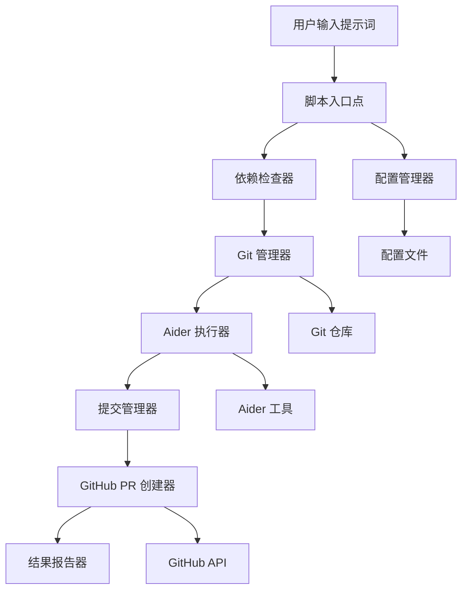

# 设计文档

## 概述

Aider 自动化脚本是一个 Python 命令行工具，它集成了 aider AI 编程助手、Git 版本控制和 GitHub API，提供从代码修改到 PR 创建的完整自动化工作流程。该脚本设计为可在任意项目中使用的独立工具。

## 架构

### 高层架构



### 核心组件

1. **主脚本 (main.py)** - 入口点和工作流程协调
2. **配置管理器 (config.py)** - 处理配置文件和环境变量
3. **依赖检查器 (dependencies.py)** - 验证必要工具的可用性
4. **Git 管理器 (git_manager.py)** - 处理所有 Git 操作
5. **Aider 执行器 (aider_executor.py)** - 管理 aider 工具的调用
6. **GitHub 集成器 (github_integration.py)** - 处理 GitHub API 调用
7. **日志管理器 (logger.py)** - 统一的日志记录

## 组件和接口

### 主脚本 (main.py)

```python
class AiderAutomationScript:
    def __init__(self, config_path: Optional[str] = None)
    def run(self, prompt: str, branch_name: Optional[str] = None) -> bool
    def _validate_environment(self) -> bool
    def _execute_workflow(self, prompt: str, branch_name: str) -> bool
```

**职责：**
- 解析命令行参数
- 协调整个工作流程
- 处理顶层异常和错误报告

### 配置管理器 (config.py)

```python
@dataclass
class Config:
    github_token: str
    github_repo: str
    aider_options: List[str]
    default_branch: str
    commit_message_template: str
    pr_title_template: str
    pr_body_template: str

class ConfigManager:
    def __init__(self, config_path: Optional[str] = None)
    def load_config(self) -> Config
    def validate_config(self, config: Config) -> bool
    def get_default_config(self) -> Config
```

**职责：**
- 加载和验证配置文件
- 管理环境变量
- 提供默认配置选项

### 依赖检查器 (dependencies.py)

```python
class DependencyChecker:
    def check_aider(self) -> bool
    def check_git(self) -> bool
    def check_github_access(self, token: str) -> bool
    def check_all_dependencies(self, config: Config) -> List[str]
```

**职责：**
- 验证 aider 工具是否安装和可用
- 检查 Git 环境
- 验证 GitHub API 访问权限

### Git 管理器 (git_manager.py)

```python
class GitManager:
    def __init__(self, repo_path: str = ".")
    def create_branch(self, branch_name: str) -> bool
    def switch_branch(self, branch_name: str) -> bool
    def has_changes(self) -> bool
    def add_all_changes(self) -> bool
    def commit_changes(self, message: str) -> bool
    def push_branch(self, branch_name: str) -> bool
    def get_current_branch(self) -> str
    def get_remote_url(self) -> str
```

**职责：**
- 管理 Git 分支操作
- 处理文件更改的提交
- 推送更改到远程仓库

### Aider 执行器 (aider_executor.py)

```python
class AiderExecutor:
    def __init__(self, config: Config)
    def execute(self, prompt: str) -> AiderResult
    def _build_command(self, prompt: str) -> List[str]
    def _parse_output(self, output: str) -> AiderResult

@dataclass
class AiderResult:
    success: bool
    modified_files: List[str]
    summary: str
    error_message: Optional[str]
```

**职责：**
- 构建和执行 aider 命令
- 解析 aider 的输出结果
- 提取修改文件列表和摘要信息

### GitHub 集成器 (github_integration.py)

```python
class GitHubIntegrator:
    def __init__(self, token: str, repo: str)
    def create_pull_request(self, branch_name: str, title: str, body: str) -> PRResult
    def _get_repo_info(self) -> Tuple[str, str]
    def _format_pr_body(self, aider_result: AiderResult, prompt: str) -> str

@dataclass
class PRResult:
    success: bool
    pr_url: Optional[str]
    pr_number: Optional[int]
    error_message: Optional[str]
```

**职责：**
- 创建 GitHub Pull Request
- 格式化 PR 标题和描述
- 处理 GitHub API 错误

## 数据模型

### 配置文件结构 (.aider-automation.json)

```json
{
  "github": {
    "token": "${GITHUB_TOKEN}",
    "repo": "owner/repository-name"
  },
  "aider": {
    "options": ["--no-pretty", "--yes"],
    "model": "gpt-4"
  },
  "git": {
    "default_branch": "main",
    "branch_prefix": "aider-automation/"
  },
  "templates": {
    "commit_message": "feat: {summary}",
    "pr_title": "AI-generated changes: {summary}",
    "pr_body": "## 自动生成的更改\n\n**提示词：** {prompt}\n\n**修改的文件：**\n{modified_files}\n\n**Aider 摘要：**\n{aider_summary}"
  }
}
```

### 工作流程状态

```python
@dataclass
class WorkflowState:
    prompt: str
    branch_name: str
    config: Config
    aider_result: Optional[AiderResult] = None
    commit_hash: Optional[str] = None
    pr_result: Optional[PRResult] = None
    start_time: datetime = field(default_factory=datetime.now)
    end_time: Optional[datetime] = None
```

## 错误处理

### 错误类型层次

```python
class AiderAutomationError(Exception):
    """基础异常类"""
    pass

class ConfigurationError(AiderAutomationError):
    """配置相关错误"""
    pass

class DependencyError(AiderAutomationError):
    """依赖项缺失或不可用"""
    pass

class GitOperationError(AiderAutomationError):
    """Git 操作失败"""
    pass

class AiderExecutionError(AiderAutomationError):
    """Aider 执行失败"""
    pass

class GitHubAPIError(AiderAutomationError):
    """GitHub API 调用失败"""
    pass
```

### 错误处理策略

1. **配置错误** - 提供清晰的错误信息和修复建议
2. **依赖项错误** - 指导用户安装缺失的工具
3. **Git 错误** - 提供 Git 状态信息和可能的解决方案
4. **Aider 错误** - 显示 aider 的详细错误输出
5. **GitHub API 错误** - 解释 API 错误并提供重试选项

## 测试策略

### 单元测试

- **配置管理器测试** - 测试配置加载、验证和默认值
- **Git 管理器测试** - 使用临时 Git 仓库测试所有 Git 操作
- **Aider 执行器测试** - 模拟 aider 命令执行和输出解析
- **GitHub 集成器测试** - 使用模拟 API 响应测试 PR 创建

### 集成测试

- **端到端工作流程测试** - 在测试仓库中执行完整流程
- **错误场景测试** - 测试各种失败情况的处理
- **配置变体测试** - 测试不同配置选项的组合

### 测试工具和框架

- **pytest** - 主要测试框架
- **pytest-mock** - 模拟外部依赖
- **responses** - 模拟 HTTP API 调用
- **GitPython** - 创建和管理测试 Git 仓库

### 测试数据管理

- 使用临时目录和 Git 仓库进行隔离测试
- 模拟 GitHub API 响应数据
- 预定义的配置文件模板用于测试不同场景